# Neothink Ecosystem Overview

**Last Updated:** October 2, 2025
**Organization:** [neothink-dao](https://github.com/neothink-dao)
**Total Projects:** 13 repositories + 2 local directories

---

## 🏗️ Architecture Overview

```mermaid
%%{init: {'theme':'base', 'themeVariables': { 'primaryColor':'#4CAF50', 'primaryTextColor':'#fff', 'primaryBorderColor':'#2E7D32', 'lineColor':'#666'}}}%%
graph TD
    A[Neothink Ecosystem] --> B[Core Platforms]
    A --> C[Community Sites]
    A --> D[Infrastructure]
    A --> E[Documentation]

    B --> B1[neothink-web<br/>Next.js 15.5 Web App]
    B --> B2[neothink-mobile<br/>Expo React Native]
    B --> B3[neothink-admin<br/>Next.js Admin Dashboard]

    C --> C1[joinneothinkers<br/>Happiness Community]
    C --> C2[joinascenders<br/>Prosperity Community]
    C --> C3[joinimmortals<br/>Longevity Community]

    D --> D1[neothink-supabase<br/>PostgreSQL + Vector]
    D --> D2[.github<br/>Org Configuration]

    E --> E1[neothink-com<br/>SEO Strategy & Research]
    E --> E2[neo-tech-stack<br/>Tech Documentation]
    E --> E3[docs<br/>General Docs]
    E --> E4[claudedocs<br/>AI Assistant Docs]

    style B1 stroke:#2E7D32,stroke-width:3px
    style B2 stroke:#2E7D32,stroke-width:3px
    style B3 stroke:#2E7D32,stroke-width:3px
```



---

## 📊 Repository Status Matrix

| Repository | Type | Status | GitHub | Tech Stack |
|-----------|------|--------|--------|------------|
| **neothink-web** | Core Platform | ✅ Active | [web](https://github.com/neothink-dao/web) | Next.js 15.5 + React 19.1 + Vercel AI SDK |
| **neothink-mobile** | Core Platform | ✅ Active | [mobile](https://github.com/neothink-dao/mobile) | Expo + React Native |
| **neothink-admin** | Core Platform | ✅ Active | [admin](https://github.com/neothink-dao/admin) | Next.js 15.5 + Admin UI |
| **joinneothinkers** | Community | ✅ Active | [neothinkers](https://github.com/neothink-dao/neothinkers) | Membership Platform |
| **joinascenders** | Community | ✅ Active | [ascenders](https://github.com/neothink-dao/ascenders) | Membership Platform |
| **joinimmortals** | Community | ✅ Active | [immortals](https://github.com/neothink-dao/immortals) | Membership Platform |
| **neothink-com** | Documentation | ✅ Public | [neothink.com](https://github.com/neothink-dao/neothink.com) | SEO Research + Strategy |
| **neo-tech-stack** | Documentation | ✅ Active | [neo-tech](https://github.com/neothink-dao/neo-tech) | Technical Documentation |
| **.github** | Infrastructure | ✅ Active | [.github](https://github.com/neothink-dao/.github) | Org Profile + Templates |
| **neothink-supabase** | Infrastructure | 🔒 Local | N/A | Supabase Configuration |
| **docs** | Documentation | 📁 Local | N/A | General Documentation |
| **claudedocs** | Documentation | 📁 Local | N/A | AI Assistant Knowledge |
| **neothink-legacy** | Archive | 📦 Archived | N/A | Legacy Codebase |

---

## 🌟 Core Platforms

### 1. **neothink-web** - Primary Web Application
**Repository:** https://github.com/neothink-dao/web
**Purpose:** Main website and content platform
**Technology:**
- Next.js 15.5 with Turbopack
- React 19.1 with Server Components
- TypeScript 5.9 native execution
- Vercel AI SDK 5.0 integration
- Supabase backend

**Key Features:**
- 94.48% engagement rate
- 4,256 annual organic clicks (~355/month)
- AI-native architecture
- Multi-modal content delivery
- Real-time analytics

**Dev Command:** `npm run dev` (Turbopack)

---

### 2. **neothink-mobile** - Cross-Platform Mobile App
**Repository:** https://github.com/neothink-dao/mobile
**Purpose:** Mobile access to Neothink content and community
**Technology:**
- Expo + React Native
- NativeWind for styling
- Supabase integration
- Cross-platform (iOS/Android)

**Dev Command:** `expo start`

---

### 3. **neothink-admin** - Administration Dashboard
**Repository:** https://github.com/neothink-dao/admin
**Purpose:** Content management and user administration
**Technology:**
- Next.js 15.5 with Turbo
- Admin UI components
- Supabase admin access
- Analytics dashboard

**Dev Command:** `npm run dev --turbo`

---

## 🎯 Community Platforms

### 1. **joinneothinkers** - Happiness Community
**Repository:** https://github.com/neothink-dao/neothinkers
**Focus:** Integrated thinkers seeking greater **HAPPINESS** through consciousness expansion
**Features:** Philosophy-based community, discussion forums, exclusive content

### 2. **joinascenders** - Prosperity Community
**Repository:** https://github.com/neothink-dao/ascenders
**Focus:** Value creators seeking greater **PROSPERITY** through business growth
**Features:** Business coaching, entrepreneurship resources, wealth creation strategies

### 3. **joinimmortals** - Longevity Community
**Repository:** https://github.com/neothink-dao/immortals
**Focus:** Self-leaders seeking greater **LONGEVITY** through health optimization
**Features:** Health resources, longevity research, biological immortality content

---

## 🗄️ Infrastructure

### 1. **neothink-supabase** - Backend Services
**Location:** Local directory (not on GitHub)
**Purpose:** Database configuration and backend infrastructure
**Technology:**
- PostgreSQL 15+ with vector search
- Real-time subscriptions
- Row-level security policies
- Edge functions

**Backup:** `neothink-supabase-backup-20250929-181734.tar.gz` (1.4MB)

### 2. **.github** - Organization Configuration
**Repository:** https://github.com/neothink-dao/.github
**Purpose:** GitHub organization profile and templates
**Contents:**
- Organization README
- Issue templates
- PR templates
- Contributing guidelines
- Security policy

---

## 📚 Documentation & Research

### 1. **neothink-com** - SEO Strategy & Research ✨ NEWLY PUBLIC
**Repository:** https://github.com/neothink-dao/neothink.com
**Purpose:** Strategic SEO research, market analysis, and content strategy
**Key Deliverables:**
- 29,243 keywords analyzed
- 113M+ monthly search opportunity identified
- Complete SEO audit (A+ 10/10 excellence)
- Phase-based implementation roadmap
- 7 visual Mermaid diagrams (light/dark mode)

**Contents:**
- `README.md` - Entry point and quick start
- `STATUS.md` - Current SEO performance (4,256 annual clicks, 94.48% engagement)
- `NEOTHINK-SEO-REALITY-REPORT.md` - Complete analysis
- `execute/priority-actions.md` - Implementation roadmap
- `opportunities/*.md` - 5 detailed opportunity guides
- `data/keyword-research/` - 29K keywords + DuckDB analysis

### 2. **neo-tech-stack** - Technical Documentation
**Repository:** https://github.com/neothink-dao/neo-tech
**Purpose:** Comprehensive technical documentation and implementation guides
**Focus:** Architecture, best practices, technology standards

### 3. **docs** - General Documentation
**Location:** Local directory
**Purpose:** Cross-project documentation and shared resources

### 4. **claudedocs** - AI Assistant Documentation
**Location:** Local directory
**Purpose:** Claude-specific documentation and project context
**Contents:** AI assistant knowledge base, development guidelines

---

## 🔗 Technology Stack Summary

### **Frontend**
- **Framework:** Next.js 15.5 with Turbopack (2-5x faster builds)
- **UI Library:** React 19.1 with Server Components
- **Language:** TypeScript 5.9 (native Node.js execution)
- **Styling:** Tailwind CSS 4.x with Oxide engine (100x faster)
- **Components:** shadcn/ui Platform + Magic UI + Radix UI

### **AI & Analytics**
- **AI Framework:** Vercel AI SDK 5.0
- **AI Models:** OpenAI GPT-4, Anthropic Claude 3, Google Gemini
- **Analytics:** Advanced real-time monitoring
- **Observability:** OpenTelemetry + Langfuse integration

### **Backend**
- **Database:** Supabase (PostgreSQL 15+ with vector search)
- **Authentication:** Supabase Auth with SSR
- **Storage:** Supabase Storage with CDN
- **Real-time:** Supabase Realtime subscriptions

### **Mobile**
- **Framework:** Expo + React Native
- **Styling:** NativeWind (Tailwind for React Native)
- **Cross-platform:** iOS + Android

### **Deployment**
- **Hosting:** Vercel Edge Network
- **CDN:** Global content delivery
- **Database:** Supabase managed PostgreSQL
- **DNS:** Vercel DNS management

---

## 📈 Performance Metrics

### **Web Platform (neothink-web)**
- **Core Web Vitals:** 90+ scores
- **Page Load Speed:** <1.8s First Contentful Paint
- **Engagement Rate:** 94.48% (exceptional)
- **SEO:** Comprehensive optimization with schema markup

### **SEO Performance (neothink-com)**
- **Annual Organic Clicks:** 4,256 (~355/month)
- **Engagement Rate:** 94.48%
- **Brand Authority:** Positions 1-3 for all brand terms
- **Market Opportunity:** 113M+ monthly searches identified
- **Content Library:** 91 published pieces (32 pages + 42 posts + 17 podcasts)

### **Business Metrics**
- **Revenue:** $13,757/year from organic (verified)
- **Conversion Rate:** 0.65% (organic visitors to customers)
- **Average Order Value:** $497 (Level 2 product)
- **Global Reach:** 138+ countries

---

## 🚀 Quick Start Commands

### **Web Development**
```bash
cd neothink-web
npm install
npm run dev          # Start with Turbopack
```

### **Mobile Development**
```bash
cd neothink-mobile
npm install
expo start           # Start Expo dev server
```

### **Admin Dashboard**
```bash
cd neothink-admin
npm install
npm run dev --turbo  # Start with Turbo
```

### **SEO Research**
```bash
cd neothink-com
pnpm validate        # Validate markdown
pnpm serve           # Serve docs on port 8000
```

---

## 🔧 Development Workflow

### **Branch Strategy**
- `main` - Production-ready code
- `develop` - Integration branch
- `feature/*` - Feature development
- `fix/*` - Bug fixes

### **Quality Standards**
- ✅ TypeScript strict mode
- ✅ ESLint + Prettier enforcement
- ✅ Comprehensive testing (Vitest + Playwright)
- ✅ AI safety validation
- ✅ Performance monitoring
- ✅ Accessibility compliance (WCAG 2.1 AA)

### **CI/CD Pipeline**
- Automated testing on PR
- Performance benchmarking
- Security scanning
- Automatic deployment to Vercel

---

## 📞 Support & Resources

### **Organization Links**
- **GitHub Org:** https://github.com/neothink-dao
- **Main Website:** https://neothink.com
- **SEO Research:** https://github.com/neothink-dao/neothink.com

### **Documentation**
- **Web Platform:** [README](./neothink-web/README.md)
- **SEO Strategy:** [README](./neothink-com/README.md)
- **Tech Stack:** [neo-tech-stack](./neo-tech-stack/)
- **Project Context:** [CLAUDE.md](./CLAUDE.md)

---

## 🎯 Next Steps & Priorities

### **Immediate Focus (Q4 2025)**
1. ✅ **SEO Strategy** - Implementation of Phase 1 quick wins from neothink-com
2. **Mobile Launch** - Complete neothink-mobile development
3. **Community Growth** - Scale membership platforms (neothinkers, ascenders, immortals)
4. **AI Enhancement** - Expand Vercel AI SDK integration across platforms

### **Medium-term (Q1 2026)**
1. **Content Expansion** - Execute keyword expansion strategy (113M opportunity)
2. **Performance Optimization** - Achieve <1s page load globally
3. **International** - Multi-language support and localization
4. **Advanced Analytics** - Enhanced AI-powered insights

---

**Ecosystem Health: ✅ Excellent**
**Documentation Status: ✅ Complete**
**Development Velocity: ⚡ High**
**Strategic Clarity: 🎯 Clear**

---

*Last Updated: October 2, 2025 • 13 Active Projects • AI-Native Architecture*
