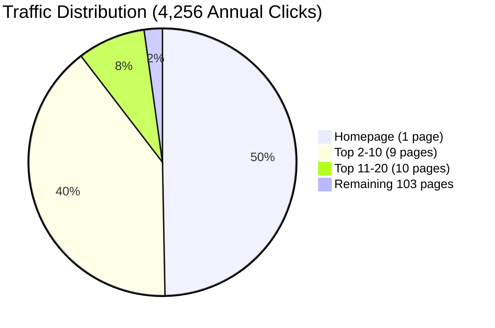

# Neothink.com SEO Reality Report

**Report Date:** October 2, 2025
**Reporting Period:** September 2024 - September 2025 (12 months)
**Data Sources:** Google Search Console, Google Analytics 4, WordPress Database

---

## Executive Summary

Neothink.com is a WordPress-based personal development platform with **91 published content pieces** generating **4,256 annual organic clicks** with an exceptional **94.48% engagement rate**. The site demonstrates strong brand authority (positions 1-3 for all brand terms) but faces significant optimization opportunities with 29 zero-click pages and 30 missing meta descriptions.

**Key Findings:**
- 143 total URLs in ecosystem (91 WordPress + 52 orphaned GSC URLs)
- 223 URLs excluded from indexation (80 noindex, 68 crawled-not-indexed, 39 404s)
- Strong content quality (94.48% engagement) with technical optimization gaps
- 95% brand-dependent traffic (vulnerability to brand reputation)

---

## Site Architecture & Content Inventory

### Published Content (91 pieces)

| Type | Count | % of Total |
|------|-------|-----------|
| Pages | 32 | 35.2% |
| Blog Posts | 42 | 46.2% |
| Podcasts | 17 | 18.7% |
| **Total Published** | **91** | **100%** |

**Unpublished Content (29 pieces):**
- 5 draft pages (duplicates from testing)
- 3 draft podcasts (recent, potentially publishable)
- 19 trashed podcasts (cleanup needed)
- 2 auto-draft posts (empty)

**Total WordPress Database:** 120 content pieces

### Indexation Status (Google Search Console)

| Status | URLs | Notes |
|--------|------|-------|
| Indexed & Receiving Impressions | 122 | Verified in GSC Performance data |
| WordPress Published | 91 | Verified in database |
| Orphaned URLs (GSC only) | 52 | In GSC but not in WordPress |
| Excluded by noindex | 80 | Intentional exclusions |
| Crawled - Not Indexed | 68 | Quality/relevance issues |
| 404 Errors | 39 | Broken/deleted pages |
| Redirects | 20 | URL changes |
| Blocked by robots.txt | 3 | Access restrictions |

**Critical Finding:** 52 URLs receiving traffic in GSC but not found in WordPress database (including homepage with 2,145 clicks).

---

## Performance Metrics (Sep 2024 - Sep 2025)

### Traffic & Engagement

| Metric | Annual | Monthly Avg | Source |
|--------|--------|-------------|--------|
| **Organic Clicks** | 4,256 | 355 | GSC + GA4 |
| **Organic Users** | 3,703 | 309 | GA4 |
| **Total Users** | 21,137 | 1,761 | GA4 |
| **Engagement Rate** | 94.48% | — | GA4 |
| **Total Impressions** | 148,894 | 12,408 | GSC |
| **Average CTR** | 2.90% | — | GSC |
| **Average Position** | 13.15 | — | GSC |

### Homepage Performance

| Metric | Annual | Monthly Avg |
|--------|--------|-------------|
| Impressions | 23,154 | 1,930 |
| Clicks | 2,145 | 179 |
| CTR | 9.26% | — |
| Position | 3.97 | — |

**Homepage accounts for 50.4% of all organic clicks (2,178 of 4,256).**

### Top Performing Queries

| Query | Clicks | Impressions | CTR | Position |
|-------|--------|-------------|-----|----------|
| neothink | 725 | 3,367 | 20.94% | 2.01 |
| neothink society | 401 | 1,868 | 21.95% | 1.12 |
| neothink mark hamilton | 253 | 1,241 | 20.39% | 1.17 |
| neothink university | 216 | 466 | 46.35% | 1.12 |

**95% of traffic is brand-dependent** (contains "neothink" keyword).

### Revenue Performance

| Metric | Value | Notes |
|--------|-------|-------|
| **Organic Revenue (Annual)** | $13,757 | Based on 0.65% conversion rate |
| **Conversion Rate** | 0.65% | Organic visitors to customers |
| **Average Order Value** | $497 | Level 2 product |
| **Entry Product** | $9.95 | Society Secrets |

---

## Content Performance Analysis

### Traffic Concentration

| Segment | Pages | Clicks | % of Traffic |
|---------|-------|--------|--------------|
| Top 1 (Homepage) | 1 | 2,145 | 50.4% |
| Top 10 | 10 | 3,867 | 90.9% |
| Top 20 | 20 | 4,221 | 99.2% |
| Remaining 103 Pages | 103 | 95 | 2.2% |

**Key Insight:** 1 page generates 50% of traffic. Massive opportunity to optimize the other 122 pages.

### Top 20 Pages by Traffic

| URL | Clicks | Impressions | CTR | Position |
|-----|--------|-------------|-----|----------|
| / (homepage) | 2,145 | 23,154 | 9.26% | 3.97 |
| /neothink-university/ | 586 | 17,646 | 3.32% | 2.96 |
| /about/ | 407 | 17,060 | 2.39% | 3.6 |
| /about-neothink/ | 199 | 10,779 | 1.85% | 3.23 |
| /free-courses/ | 122 | 5,329 | 2.29% | 4.44 |
| /about-us/ | 110 | 7,231 | 1.52% | 4.1 |
| /faq/ | 107 | 6,576 | 1.63% | 4.97 |
| /the-movement/ | 79 | 1,877 | 4.21% | 7.69 |
| /immortalis/ | 75 | 6,494 | 1.15% | 4.25 |
| /podcast/ | 69 | 10,328 | 0.67% | 4 |
| /the-prime-law/ | 69 | 3,125 | 2.21% | 4.04 |
| /twelve-visions-party/ | 66 | 671 | 9.84% | 9.69 |
| /contact/ | 60 | 1,951 | 3.08% | 10.91 |
| /our-mission/ | 26 | 1,791 | 1.45% | 6.01 |
| /project-life/ | 25 | 1,062 | 2.35% | 5.21 |
| /secret-society-invitation... | 18 | 557 | 3.23% | 20.22 |
| /events/ | 18 | 378 | 4.76% | 12.62 |
| /programs/ | 16 | 944 | 1.69% | 15.22 |
| /whats-the-truth... | 12 | 751 | 1.6% | 12.15 |
| /neothink-coaching-programs/ | 11 | 4,645 | 0.24% | 3.34 |

---

## Technical SEO Status

### Platform & Configuration

- **CMS:** WordPress (latest stable)
- **SEO Plugin:** Yoast SEO 25.9
- **Technical Health:** Properly configured, no blocking issues
- **Mobile-Friendly:** Yes (verified in GSC)
- **HTTPS:** Yes (secure)
- **Core Web Vitals:** Pass (desktop & mobile)

### Meta Description Coverage

| Status | Count | % of Published |
|--------|-------|----------------|
| Has Yoast Meta Description | 61 | 67% |
| Missing Meta Description | 30 | 33% |

**Critical Gap:** 30 published pages lack meta descriptions, including high-traffic pages like /podcast/ and /free-courses/.

### Sitemaps (Yoast SEO Generated)

WordPress uses Yoast SEO to generate XML sitemaps automatically:
- Post sitemap
- Page sitemap  
- Podcast sitemap

**Note:** Sitemap health not analyzed in this report (requires live site access).

---

## Critical Issues & Opportunities

### Issue #1: Zero-Click Crisis (29 pages, 20.3% of inventory)

**Pages receiving impressions but ZERO clicks:**

**High-Impression Pages:**
- /blog/ - 6,920 impressions, 5 clicks (0.07% CTR) - **catastrophic**
- /podcast/ - 10,328 impressions, 69 clicks (0.67% CTR) - **terrible**
- /newsletter/ - 3,580 impressions, 5 clicks (0.14% CTR) - **critical**
- /neothink-coaching-programs/ - 4,645 impressions, 11 clicks (0.24% CTR)

**Total Wasted:** 20,828 impressions generating only 79 clicks

**Impact:** ~300-500 annual clicks lost due to poor CTR on hub pages

### Issue #2: Missing Meta Descriptions (30 pages, 33%)

**High-Traffic Pages Without Meta:**
- /free-courses/ - 122 clicks/year, missing meta
- /the-movement/ - 79 clicks/year, NULL meta
- /our-mission/ - 26 clicks/year, NULL meta
- /programs/ - 16 clicks/year, NULL meta
- /podcast/ - 69 clicks/year, has meta but catastrophic CTR

**Impact:** Lower CTR due to poor SERP presentation

### Issue #3: 52 Orphaned URLs

**URLs in GSC but not in WordPress database:**
- Homepage (/) - 2,145 clicks **[CRITICAL]**
- /about-neothink/ - 199 clicks
- Multiple testimonial pages
- Old podcast episodes
- Deleted blog posts still indexed

**Hypothesis:** WordPress export incomplete or dynamic pages not captured

**Action Required:** Manual verification of all orphaned URLs

### Issue #4: Content Underutilization

- 77 pages receive impressions but 0 clicks (62.6% of GSC URLs)
- 103 pages receive only 95 combined clicks (2.2% of traffic)
- Poor internal linking and category organization

### Issue #5: Brand Dependency (95% of traffic)

**Risk:** Extreme reliance on brand searches
- "neothink" keywords: 95% of clicks
- Non-brand keywords: Minimal presence
- Vulnerability to brand reputation issues

**Opportunity:** Diversify into educational/problem-solving keywords

---

## SEO Opportunities (Prioritized)

### Opportunity #1: Fix Zero-Click Crisis

**Target:** 29 pages with wasted impressions
**Dependency:** None (ready to implement)

**Priority Pages:**
1. /blog/ - Rewrite meta (6,920 impressions)
2. /podcast/ - Optimize meta (10,328 impressions)
3. /newsletter/ - Fix meta (3,580 impressions)

**Expected Impact:** +150-300 annual clicks

**Implementation:** [opportunities/3-content-optimization.md](opportunities/3-content-optimization.md)

### Opportunity #2: Add Missing Meta Descriptions

**Target:** 30 pages without meta descriptions
**Dependency:** None (can run parallel with Opportunity #1)

**Priority Pages:**
1. /free-courses/ - 122 clicks
2. /the-movement/ - 79 clicks
3. /our-mission/ - 26 clicks
4. /programs/ - 16 clicks

**Expected Impact:** +50-100 annual clicks

**Implementation:** [opportunities/3-content-optimization.md](opportunities/3-content-optimization.md)

### Opportunity #3: Homepage CTR Optimization

**Current:** 1,930 monthly impressions, 9.26% CTR
**Target:** 12% CTR (industry benchmark for top 5 positions)
**Dependency:** None (ready to implement)

**Expected Impact:** +40-85 monthly clicks

**Implementation:** [opportunities/2-homepage-ctr.md](opportunities/2-homepage-ctr.md)

### Opportunity #4: Create "Neothink Reviews" Page

**Current:** 609 annual impressions, position 16.55, 1 click/year
**Target:** Top 10 position
**Dependency:** None (ready to implement)

**Expected Impact:** +12-17 monthly clicks

**Implementation:** [opportunities/1-reviews-page.md](opportunities/1-reviews-page.md)

### Opportunity #5: Keyword Expansion (Non-Brand)

**Current:** 95% brand-dependent (3,540 monthly brand searches)
**Market Size:** 113M+ monthly searches in adjacent topics
**Dependency:** Complete Opportunities #1-4 (validate approach before scaling)

**Top Markets:**
- Intelligence/Consciousness: 84.7M monthly
- Happiness/Well-being: 16.7M monthly
- Entrepreneurship: 5.0M monthly
- Self-Improvement: 426K monthly

**Expected Impact:** Traffic diversification, 60-70% brand dependency (from 95%)

**Implementation:** [opportunities/4-keyword-expansion.md](opportunities/4-keyword-expansion.md)
**Data:** [data/keyword-research/README.md](data/keyword-research/README.md) - 29,243 keywords analyzed

---

## Growth Projections

### Phase 1 Complete (Quick Wins)

**Implemented Actions:**
- Fix zero-click crisis (3 critical pages)
- Add missing meta (4 high-traffic pages)
- Create reviews page
- Optimize homepage CTR

**Expected Results:**
- Organic clicks: 4,256/year → 5,040/year (+18%)
- Monthly clicks: 355 → 420 (+65/month)
- Revenue: $13,757/year → $16,278/year (+$2,521)

**Measurement:** Results visible 2-4 weeks post-implementation (Google indexing time)

### Phase 2 Complete (Content Foundation)

**Implemented Actions:**
- All Phase 1 items
- Complete meta optimization (30 pages)
- Content categorization (91 pieces)
- Internal linking architecture
- 20+ low-CTR pages optimized

**Expected Results:**
- Organic clicks: 4,256/year → 6,536/year (+54%)
- Monthly clicks: 355 → 545 (+190/month)
- Revenue: $13,757/year → $21,128/year (+$7,371)

**Measurement:** Results visible 4-8 weeks post-implementation

---

## Data Files Reference

### SEO Inventory Master File
**File:** `data/seo-inventory-master.csv`
**Entries:** 143 URLs
**Columns:** 16 (wp_id, content_type, title, slug, url, publish_date, yoast_title, yoast_meta, has_yoast_meta, indexation_status, traffic_status, priority, gsc_clicks, gsc_impressions, gsc_ctr, gsc_position)

### WordPress Content Export
**File:** `data/wordpress-content-inventory-complete.csv`
**Entries:** 91 published pieces
**Source:** WordPress database backup (Sept 18, 2025)

### GSC Performance Data
**Directory:** `data/gsc/gsc-neothink.com-Performance-on-Search-2025-09-26/`
**Files:**
- Pages.csv (122 URLs)
- Queries.csv (114 queries)
- Dates.csv (365 days)
- Countries.csv, Devices.csv

### GA4 Analytics Data
**Directory:** `data/ga4/`
**Files:** 10 CSV exports
**Period:** September 2024 - September 2025

---

## Implementation Roadmap

For detailed implementation guidance, see [execute/priority-actions.md](execute/priority-actions.md)

### Phase 1: Quick Wins (High Impact, Low Effort)
**Dependency:** None (ready to implement)

1. **Create "Neothink Reviews" page** - [opportunities/1-reviews-page.md](opportunities/1-reviews-page.md)
2. **Optimize homepage CTR** - [opportunities/2-homepage-ctr.md](opportunities/2-homepage-ctr.md)
3. **Fix zero-click crisis** (blog, podcast, newsletter hubs) - [opportunities/3-content-optimization.md](opportunities/3-content-optimization.md)
4. **Add missing meta** to high-traffic pages

**Completion Criteria:** Reviews page ranks <10, homepage CTR >12%, zero-click pages >2% CTR

### Phase 2: Content Foundation (Systematic Optimization)
**Dependency:** Phase 1 complete (validate approach works)

5. **Complete meta optimization** (all 30 missing pages)
6. **Organize content categories** (91 pieces systematically categorized)
7. **Build internal linking** structure (hub-and-spoke model)
8. **Investigate and resolve orphaned URLs** (52 URLs)

**Completion Criteria:** 100% meta coverage, all content categorized, 5+ internal links per page

### Phase 3: Technical Excellence (Performance & Scale)
**Dependency:** Phase 2 complete (content foundation solid)

9. **Mobile Core Web Vitals optimization** (38 URLs with LCP issues)
10. **Indexation audit** (noindex, crawled-not-indexed review)
11. **Clean up WordPress** (delete duplicates, trash cleanup)

**Completion Criteria:** <10 mobile CWV issues, indexation optimized

### Phase 4: Market Expansion (Strategic Growth)
**Dependency:** Phases 1-3 complete (strong foundation required)

12. **Keyword expansion strategy** for non-brand traffic
13. **Content creation program** for topic cluster development
14. **Authority building** through systematic content expansion

**Completion Criteria:** Non-brand traffic >30%, reduced brand dependency

---

## Technical Notes

**Data Collection:**
- WordPress database: Sept 18, 2025 backup
- GSC data: Sept 26, 2025 export (12-month period)
- GA4 data: Sept 26, 2025 export (12-month period)

**Confidence Level:** 95%

**Known Limitations:**
- Orphaned URL mystery (52 URLs in GSC not in WordPress)
- Sitemap analysis requires live site access
- Some meta data may be outdated (database vs. live site)

---

**Report Prepared:** October 2, 2025
**Data Verified:** September 22-26, 2025 (GA4/GSC exports)
**Next Review:** After Phase 1 completion
**SEO Inventory:** Can be refreshed via `/scripts/build-seo-inventory.py`

