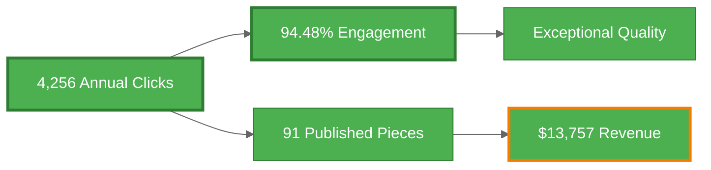

# Neothink.com SEO Optimization

Complete SEO analysis and implementation roadmap for Neothink.com.

## Current Performance

**Organic Traffic:** 4,256 clicks/year (~355/mo) • **Engagement:** 94.48% • **Content:** 91 published pieces

## Where to Start (Decision Tree)

**👋 New team member?** → [TEAM-BRIEFING.md](TEAM-BRIEFING.md) - Strategic overview and context

**⚠️ Week 1 execution team?** → [execute/data-quality-issues.md](execute/data-quality-issues.md) - Foundation Sprint protocols

**📊 Need metric clarity?** → [data/BASELINE-RECONCILIATION.md](data/BASELINE-RECONCILIATION.md) - Single source of truth

**🚀 SEO implementation?** → [execute/priority-actions.md](execute/priority-actions.md) - Phase 1-5 roadmap with gates

**🔄 Retention strategy?** → [execute/retention-strategy.md](execute/retention-strategy.md) - Stage-based framework

**⚠️ Risk assessment?** → [STRATEGIC-RISKS.md](STRATEGIC-RISKS.md) - Honest risk framing

**🎯 Specific opportunities?** → [opportunities/](opportunities/) - Reviews page, homepage CTR, zero-click fixes

**📖 Full analysis?** → [NEOTHINK-SEO-REALITY-REPORT.md](NEOTHINK-SEO-REALITY-REPORT.md) - Complete audit

**🔢 Quick overview?** → [STATUS.md](STATUS.md) - Current performance snapshot

---

### ⚠️ CRITICAL: Do not skip to Phase 4 without:
1. ✅ Foundation Sprint complete (GA4 fixed, traffic reconciled, retention strategy created)
2. ✅ Phases 1-3 validated (quick wins → content optimization → technical fixes)
3. ✅ **Retention improved to >5%** (NON-NEGOTIABLE - Phase 4 blocked without this)

**Why retention >5% is mandatory:** Phase 4 is 6-12 months keyword expansion (high effort). Without retention, you acquire users who leave immediately (2.5% = 97.5% gone = no compounding = treadmill growth).

## Top 5 Opportunities

1. **Reviews Page** - 51 impressions/mo, missing → [opportunities/1-reviews-page.md](opportunities/1-reviews-page.md)
2. **Homepage CTR** - 1,930 impressions/mo, 9.26% → [opportunities/2-homepage-ctr.md](opportunities/2-homepage-ctr.md)
3. **Content Optimization** - 29 zero-click pages, 30 missing meta → [opportunities/3-content-optimization.md](opportunities/3-content-optimization.md)
4. **Keyword Expansion** - Non-brand diversification → [opportunities/4-keyword-expansion.md](opportunities/4-keyword-expansion.md)
5. **Technical Fixes** - Mobile CWV, indexation → [opportunities/5-technical-fixes.md](opportunities/5-technical-fixes.md)

## Key Resources

- **SEO Inventory:** [data/seo-inventory-master.csv](data/seo-inventory-master.csv) - All 143 URLs with priorities
- **Verified Metrics:** [data/metrics.csv](data/metrics.csv) - Baseline performance data
- **Implementation Guide:** [execute/priority-actions.md](execute/priority-actions.md) - Phase-based roadmap

## Quick Facts

- 91 published pieces (32 pages + 42 posts + 17 podcasts)
- $13,757 annual organic revenue
- Strong brand authority (positions 1-3 for all "neothink" terms)
- 94.48% engagement rate (exceptional quality)

---

**Last Updated:** October 6, 2025
