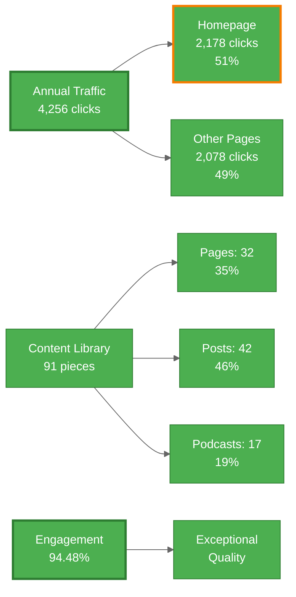
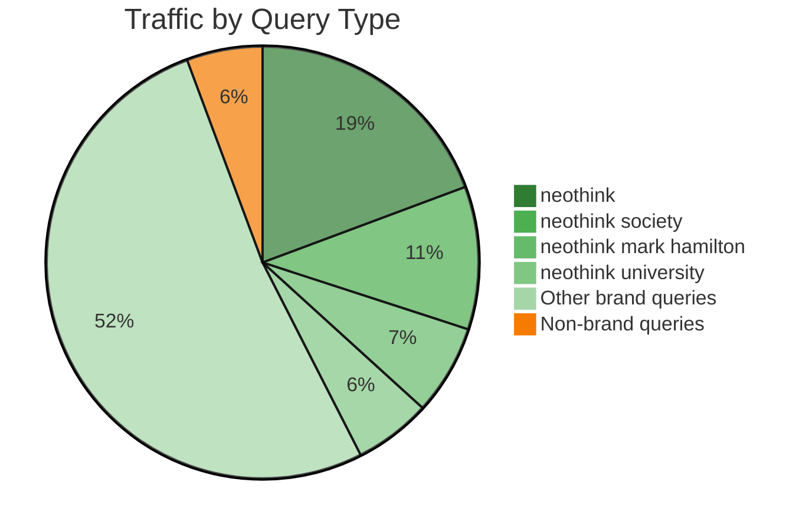

# Neothink.com SEO Status

**Last Updated:** October 6, 2025
**Data Source:** [data/metrics.csv](data/metrics.csv) (verified GA4/GSC exports)

---

## 📊 CURRENT PERFORMANCE

### Core Metrics

**Traffic Distribution:**
- **Organic Clicks**: 4,256 annually (~355/month)
- **Organic Users**: 3,703 annually (~309/month)
- **Total Users**: 21,137 annually (~1,761/month)
- **Engagement Rate**: 94.48% (exceptional)

**Content Library**: 91 published pieces (32 pages + 42 posts + 17 podcasts)

### Search Performance

**Brand Dominance (95% of traffic):**

- **Top Brand Query**: "neothink" - 725 clicks, 20.94% CTR, Position 2.01
- **Secondary Brand**: "neothink society" - 401 clicks, 21.95% CTR, Position 1.12
- **Homepage**: 2,178 clicks (51% of total organic)

### Technical Health
- WordPress + Yoast SEO 25.9 (properly configured)
- 1 indexing issue only (Post ID 1782)
- 0 server errors
- Desktop Core Web Vitals: Excellent

---

## 🎯 TOP 3 PRIORITIES

### 1. "Neothink Reviews" Landing Page
- **Current**: 609 annual impressions (~51/month), position 16.55, 1 click/year
- **Opportunity**: Create dedicated page for "neothink reviews" search intent
- **Expected Impact**: 12-17 monthly clicks (1,700% improvement)
- **Implementation**: [opportunities/1-reviews-page.md](opportunities/1-reviews-page.md)

### 2. Homepage CTR Optimization
- **Current**: 23,154 annual impressions (~1,930/month), 9.26% CTR
- **Opportunity**: Optimize title/meta to improve CTR to 12%+
- **Expected Impact**: 40-85 additional monthly clicks
- **Implementation**: [opportunities/2-homepage-ctr.md](opportunities/2-homepage-ctr.md)

### 3. Content Optimization (Zero-Click Crisis)
- **Current**: 29 zero-click pages (20.3%), 30 missing meta descriptions
- **Critical Pages**: /blog/ (6,920 impressions, 0.07% CTR), /podcast/ (10,328 impressions, 0.67% CTR)
- **Expected Impact**: 150-300 annual clicks
- **Implementation**: [opportunities/3-content-optimization.md](opportunities/3-content-optimization.md)

---

## 🚀 GETTING STARTED

**Implementation Roadmap:** [execute/priority-actions.md](execute/priority-actions.md)

Phase-based approach with clear dependencies:
- Phase 1: Quick Wins (reviews page, homepage CTR, zero-click fixes)
- Phase 2: Content Optimization (categorization, meta, internal linking)
- Phase 3: Technical Excellence (mobile CWV, indexation)
- Phase 4: Market Expansion (non-brand keywords, authority building)

---

## 📈 GROWTH TARGETS

### Realistic Projections
- **Near-term**: Focus on implementation quality over timeline
- **Revenue baseline**: $13,757/year from organic (4,256 clicks × 0.65% conversion × $497)
- **Growth methodology**: Evidence-based optimization, measured results

### Success Metrics
- Implement Phase 1 quick wins
- Monitor results 2-4 weeks post-implementation (Google indexing time)
- Maintain 94.48% engagement rate
- Improve CTR on zero-click pages

---

## 🛡️ WHAT TO PRESERVE

- ✅ 94.48% engagement rate
- ✅ Brand authority (positions 1-3 for all brand terms)
- ✅ Technical foundation (WordPress + Yoast properly configured)
- ✅ Content quality (91 published pieces)

---

*This is the single source of truth for Neothink.com SEO status. All decisions reference this baseline.*
