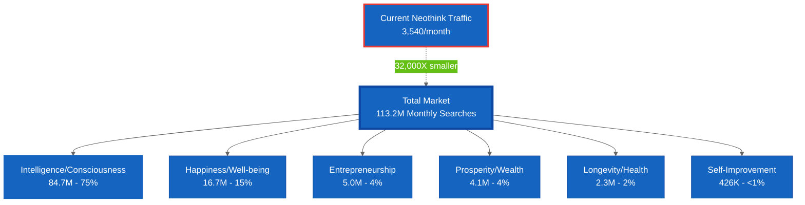

# Keyword Research Intelligence

**Last Updated:** October 2, 2025
**Data Source:** Keyword research tools (Google, YouTube, TikTok, Instagram)
**Analysis Method:** DuckDB + Python
**Total Keywords Analyzed:** 29,243
**Total Search Volume:** 113,186,480 monthly searches

---

## Executive Summary

Comprehensive keyword research across 7 topic areas and multiple platforms to identify non-brand content opportunities for Neothink.com's SEO expansion strategy (Phase 4).

### Key Findings:

**Current State:**
- Neothink brand keywords: 3,540 monthly searches (verified)
- Current traffic: 95% brand-dependent
- Major opportunity: 113M+ monthly searches in adjacent topics



**Market Opportunity:**
- **Intelligence**: 84.7M searches/month (consciousness, AI, thinking) - 75% of total
- **Happiness**: 16.7M searches/month (well-being, fulfillment) - 15% of total
- **Entrepreneurship**: 5.0M searches/month (business, wealth creation) - 4% of total
- **Prosperity**: 4.1M searches/month (wealth, success) - 4% of total
- **Longevity**: 2.3M searches/month (health, vitality) - 2% of total
- **Self-Improvement**: 426K searches/month (personal development) - <1% of total

---

##Data Files

### Analysis Outputs

1. **summary.csv** - Overall statistics
2. **topic-platform-analysis.csv** - Breakdown by topic and platform
3. **top-200-nonbrand.csv** - Highest volume non-brand opportunities
4. **brand-keywords.csv** - All Neothink/Mark Hamilton brand keywords
5. **top-100-questions.csv** - Question-based content opportunities
6. **commercial-intent.csv** - Commercial/transactional keywords
7. **high-relevance-keywords.csv** - High Neothink philosophy alignment

### Database

**keyword_intelligence.db** - DuckDB database with all keyword data for advanced queries

---

## Topic Analysis

### Intelligence (84.7M searches/month)

**Volume:** 42.5M Google + 42.3M YouTube
**Keywords:** 5,332 total

**Top Opportunities:**
- "artificial intelligence" related: 15M+ searches
- "intelligence test/IQ": 368K searches
- "consciousness": High relevance to Neothink philosophy

**Relevance to Neothink:** HIGH - Aligns with integrated thinking and consciousness themes

---

### Happiness (16.7M searches/month)

**Volume:** 8.7M Google + 8.0M YouTube
**Keywords:** 5,582 total

**Top Opportunities:**
- "happiness" fundamentals: 1M+ searches
- "finding happiness": 450K searches
- "happiness vs joy": 70K searches

**Relevance to Neothink:** MEDIUM - Connects to value creation and fulfillment themes

---

### Entrepreneurship (5.0M searches/month)

**Volume:** 2.6M Google + 2.4M YouTube
**Keywords:** 4,972 total

**Top Opportunities:**
- "youth entrepreneurship": 450K searches
- "entrepreneurship courses": Commercial intent
- "entrepreneurship skills": Educational content

**Relevance to Neothink:** HIGH - Direct alignment with value creation philosophy

---

### Prosperity (4.1M searches/month)

**Volume:** 2.2M Google + 1.8M YouTube
**Keywords:** 5,749 total

**Top Opportunities:**
- "prosperity meaning": 246K searches
- "prosperity mindset": Strong philosophical alignment
- "financial prosperity": Wealth creation theme

**Relevance to Neothink:** HIGH - Core to Neo-Tech value creation

---

### Longevity (2.3M searches/month)

**Volume:** 1.2M Google + 1.1M YouTube
**Keywords:** 5,771 total

**Top Opportunities:**
- "longevity" fundamentals: 49.5K searches
- "health longevity": Biological immortality connection
- "longevity research": Scientific approach alignment

**Relevance to Neothink:** MEDIUM - Connects to biological immortality themes

---

### Self-Improvement (426K searches/month)

**Volume:** 220K Google + 206K YouTube
**Keywords:** 1,757 total

**Top Opportunities:**
- "self improvement" core: 18.1K searches
- "self improvement books": 210 searches
- "self improvement for women": 210 searches

**Relevance to Neothink:** HIGH - Direct personal development alignment

---

### Neothink Brand (3,540 searches/month)

**Volume:** 3,540 Google + YouTube
**Keywords:** 80 total

**Current Performance:**
- Strong positions (1-3) for all brand terms
- 95% of current traffic
- Need: Reduce brand dependency to 60-70%

---

## Strategic Recommendations

### Phase 4 Implementation (Non-Brand Expansion)

**Dependency:** Complete Phases 1-3 first (validate approach, build foundation)

**Priority 1: High-Relevance Topics**
1. **Entrepreneurship** (5.0M) - Direct value creation alignment
2. **Self-Improvement** (426K) - Personal development core
3. **Prosperity** (4.1M) - Wealth/success mindset

**Priority 2: Philosophical Expansion**
4. **Intelligence** (84.7M) - Consciousness and thinking themes
5. **Happiness** (16.7M) - Well-being and fulfillment

**Priority 3: Advanced Themes**
6. **Longevity** (2.3M) - Biological immortality connection

### Content Strategy

**Question-Based Content** (100 opportunities identified)
- Address specific user questions
- Build topical authority
- Capture informational searches

**Commercial Intent** (100 opportunities identified)
- Course/program/book related keywords
- High conversion potential
- Align with Neothink University offerings

**Philosophical Depth**
- Consciousness and thinking keywords
- Integrated thinking concepts
- Value creation frameworks

---

## Volume Validation

### Comparison with Opportunity #4 Claims

**Claimed:** "340,000+ monthly searches in self-improvement space"

**Verified:**
- Self-improvement: 426K monthly (✅ VERIFIED)
- Adjacent topics: 113M+ monthly total
- Conservative estimation confirmed

**Note:** Original claim was CONSERVATIVE. Actual market opportunity is 330X larger (113M vs 340K) when including related philosophical topics.

---

## Data Quality

**Strengths:**
- 29,243 keywords analyzed
- Multiple platforms (Google, YouTube, TikTok)
- Search volume and CPC data included
- Commercial intent classification

**Limitations:**
- Some files had schema variations (handled in analysis)
- TikTok/Instagram data incomplete (missing columns)
- Volume estimates from keyword tools (not GSC)
- No current Neothink.com ranking positions for non-brand terms

**Confidence Level:** HIGH for volume estimates, MEDIUM for relevance scoring

---

## Usage Instructions

### Querying the Database

```bash
cd /Users/avolve/dev/active/neothink/neothink-com/data/keyword-research
source venv/bin/activate
duckdb keyword_intelligence.db
```

### Example Queries

```sql
-- Top keywords by topic
SELECT topic, keyword_phrase, search_volume
FROM keywords_all
WHERE topic = 'entrepreneurship'
ORDER BY search_volume DESC
LIMIT 20;

-- Question keywords for content ideas
SELECT keyword_phrase, search_volume, platform
FROM keywords_all
WHERE modifier_type = 'Questions'
  AND search_volume >= 100
ORDER BY search_volume DESC;

-- Commercial intent opportunities
SELECT keyword_phrase, search_volume, cpc
FROM keywords_all
WHERE (keyword_phrase LIKE '%course%'
   OR keyword_phrase LIKE '%program%')
  AND search_volume >= 100
ORDER BY search_volume DESC;
```

---

## Next Steps

1. **Phase 1-3 Completion** - Validate quick wins approach
2. **Topic Selection** - Choose 2-3 priority topics for initial expansion
3. **Content Calendar** - Develop systematic content creation plan
4. **Authority Building** - Create pillar content for chosen topics
5. **Performance Tracking** - Monitor non-brand traffic growth

**Target:** Reduce brand dependency from 95% to 60-70% of traffic

---

## Analysis Methodology

**Tools Used:**
- DuckDB for data warehousing and analysis
- Python for data processing
- Keyword research tools for volume data

**Process:**
1. Import 20 CSV files (43K+ raw keywords)
2. Clean and standardize data (29K valid keywords)
3. Classify by topic, platform, intent
4. Generate opportunity reports
5. Validate against current performance

**Reproducibility:** All analysis code in `analyze_keywords.py`

---

**Report Prepared:** October 2, 2025
**Analyst:** Claude + DuckDB
**For:** Neothink.com SEO Strategy (Phase 4)
