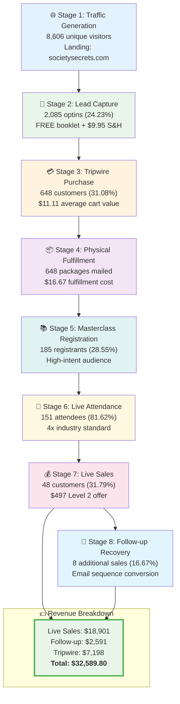
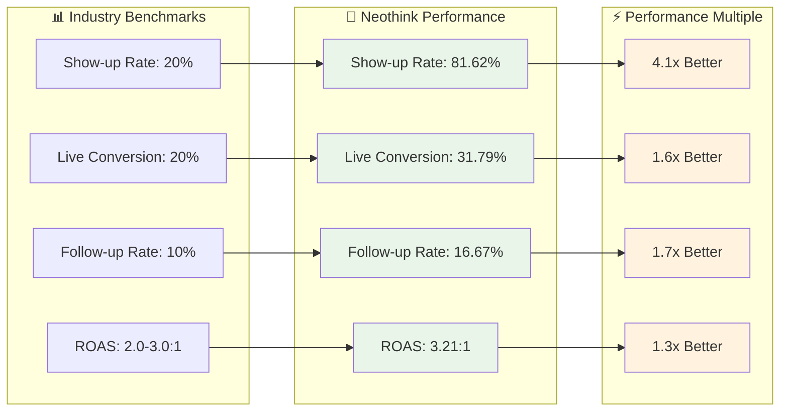

# 🎯 Complete Funnel & Customer Journey Analysis
**Society Secrets Campaign Performance & Strategy**

<div align="center">

[](.)
[](.)
[](.)
[](.)

</div>

---

## 🚀 Executive Summary

<div style="display: grid; grid-template-columns: repeat(auto-fit, minmax(200px, 1fr)); gap: 15px; margin: 20px 0;">

<div style="border: 2px solid #4CAF50; border-radius: 8px; padding: 12px; text-align: center; background: linear-gradient(135deg, #e8f5e8 0%, #f1f8e9 100%);">
<div style="font-size: 20px; font-weight: bold; color: #2E7D32;">$32,589.80</div>
<div style="font-size: 12px; color: #666;">Total Revenue</div>
</div>

<div style="border: 2px solid #2196F3; border-radius: 8px; padding: 12px; text-align: center; background: linear-gradient(135deg, #e3f2fd 0%, #e1f5fe 100%);">
<div style="font-size: 20px; font-weight: bold; color: #1565C0;">60.24%</div>
<div style="font-size: 12px; color: #666;">Profit Margin</div>
</div>

<div style="border: 2px solid #FF9800; border-radius: 8px; padding: 12px; text-align: center; background: linear-gradient(135deg, #fff3e0 0%, #fce4ec 100%);">
<div style="font-size: 20px; font-weight: bold; color: #F57C00;">3.21:1</div>
<div style="font-size: 12px; color: #666;">ROAS</div>
</div>

<div style="border: 2px solid #9C27B0; border-radius: 8px; padding: 12px; text-align: center; background: linear-gradient(135deg, #f3e5f5 0%, #e8eaf6 100%);">
<div style="font-size: 20px; font-weight: bold; color: #7B1FA2;">4x</div>
<div style="font-size: 12px; color: #666;">Industry Standard</div>
</div>

</div>

### 🎯 Campaign Context
- **Campaign Name:** Society Secrets - Greatest Secrets of All Time
- **Campaign Type:** Multi-touch direct response funnel
- **Primary Objective:** Acquire customers for $497 Level 2 offer
- **Secondary Objective:** Build qualified membership base

---

## 📈 Complete Customer Journey Visualization

<details open>
<summary><strong>🔄 Multi-Stage Conversion Funnel (Click to expand/collapse)</strong></summary>



</details>

---

## 🎯 Stage-by-Stage Performance Analysis

<details>
<summary><strong>📊 Detailed Stage Breakdown (Click to expand)</strong></summary>

### Stage 1: Traffic & Lead Generation
<div style="background: #f8f9fa; border-left: 4px solid #007bff; padding: 15px; margin: 10px 0;">

**Entry Point & Offer**
- 🌐 **Landing Page:** [societysecrets.com](https://societysecrets.com/?notrack=true)
- 📖 **Lead Magnet:** FREE "Greatest Secrets of All Time" booklet + $9.95 S&H
- 🎵 **Bump Offer:** $17 audio version (9.26% uptake rate)

**Performance Metrics:**
- 👥 **Page Views:** 8,606 unique visitors
- 📝 **Opt-in Rate:** 24.23% (2,085 optins)
- 💳 **Purchase Rate:** 31.08% of optins (648 purchases)
- 🎯 **Overall Conversion:** 7.53% (traffic to tripwire buyer)
- 💰 **Average Cart Value:** $11.11

</div>

### Stage 2: Physical Fulfillment & Mail Activation
<div style="background: #f8f9fa; border-left: 4px solid #28a745; padding: 15px; margin: 10px 0;">

**Fulfillment Package Contents:**
1. 📚 **"Greatest Secrets of All Time" booklet** (CONFIDENTIAL)
2. 📮 **Main Invitation Letter** (T5 Lead Control for Online AD)
3. 📄 **Insert Lito** (SEO Control Litho Online Ad)

**Cost Breakdown ($16.67 per order):**
- 📖 Book printing: $8.59 (51.5%)
- 📦 Shipping materials: $0.95 (5.7%)
- 🖨️ Letter printing: $0.76 (4.6%)
- 📬 Postage: $6.37 (38.2%)

</div>

### Stage 3: Masterclass Registration & Attendance
<div style="background: #f8f9fa; border-left: 4px solid #ffc107; padding: 15px; margin: 10px 0;">

**Registration Performance:**
- 📊 **Registration Rate:** 28.55% of tripwire buyers
- 👥 **Total Registrants:** 185 across all campaigns
- 🎯 **Audience Quality:** High-intent prospects

**Live Attendance (Industry-Leading Performance):**
- 👥 **Show-up Rate:** 81.62% (151 attendees from 185 registrants)
- 📊 **Industry Benchmark:** 20% (we achieve **4x industry standard**)
- 💡 **Retention During Close:** 80.58% stay for sales presentation
- 💰 **Price Reveal Retention:** 60.54% stay through pricing

</div>

### Stage 4: Live Sales Conversion
<div style="background: #f8f9fa; border-left: 4px solid #dc3545; padding: 15px; margin: 10px 0;">

**Level 2 Offer ($497):**
1. 📜 **Secret Manuscript** - 1,200 pages, gold-embossed, leatherette bound heirloom edition
2. 🎓 **Day of Enlightenment Workshop** - Full-day implementation workshop (live on Zoom)

**Conversion Performance:**
- 💰 **Live Close Rate:** 31.79% of show-ups (48 conversions from 151 attendees)
- 📊 **Revenue Per Attendee:** $497 × 31.79% = $157.99
- 💵 **Live Sales Revenue:** $18,901.00
- 📈 **Total Contract Value:** $21,401.00

</div>

### Stage 5: Follow-up Recovery
<div style="background: #f8f9fa; border-left: 4px solid #6f42c1; padding: 15px; margin: 10px 0;">

**Email Sequence Performance:**
- 📧 **Follow-up Conversion Rate:** 16.67% of live sales (8 additional sales)
- 💰 **Follow-up Revenue:** $2,591.00
- 📊 **Follow-up TCV:** $3,991.00
- 🎯 **Recovery Strategy:** Automated email nurture sequence

</div>

</details>

---

## 💰 Financial Performance Deep Dive

<details>
<summary><strong>💵 Complete Revenue & Cost Analysis (Click to expand)</strong></summary>

### Revenue Streams Breakdown

| Revenue Source | Amount | Percentage | Performance |
|----------------|--------|------------|-------------|
| 💰 **Live Level 2 Sales** | $18,901.00 | 58.0% | <span style="background: #e8f5e8; padding: 2px 8px; border-radius: 4px;">Primary Revenue</span> |
| 📧 **Follow-up Sales** | $2,591.00 | 8.0% | <span style="background: #fff3e0; padding: 2px 8px; border-radius: 4px;">Recovery Revenue</span> |
| 🎯 **Tripwire Sales** | $7,197.80 | 22.1% | <span style="background: #e3f2fd; padding: 2px 8px; border-radius: 4px;">Frontend Revenue</span> |
| **📊 Total Revenue** | **$32,589.80** | **100%** | <span style="background: #e8f5e8; padding: 2px 8px; border-radius: 4px;">**Validated**</span> |

### Cost Structure Analysis

| Cost Category | Amount | Per Unit | Efficiency |
|---------------|--------|----------|------------|
| 📱 **Ad Spend** | $10,162.75 | $15.68/buyer | <span style="color: #28a745;">Profitable</span> |
| 📦 **Fulfillment** | $2,794.17 | $16.67/order | <span style="color: #28a745;">Controlled</span> |
| **💼 Total Investment** | **$12,956.92** | **$32.35/buyer** | <span style="color: #28a745;">**Profitable**</span> |

### Profitability Metrics

<div style="display: grid; grid-template-columns: repeat(auto-fit, minmax(200px, 1fr)); gap: 15px; margin: 20px 0;">

<div style="text-align: center; padding: 15px; border: 2px solid #4CAF50; border-radius: 8px; background: #e8f5e8;">
<div style="font-size: 24px; font-weight: bold; color: #2E7D32;">$19,632.88</div>
<div style="color: #666;">Net Profit</div>
</div>

<div style="text-align: center; padding: 15px; border: 2px solid #2196F3; border-radius: 8px; background: #e3f2fd;">
<div style="font-size: 24px; font-weight: bold; color: #1565C0;">60.24%</div>
<div style="color: #666;">Profit Margin</div>
</div>

<div style="text-align: center; padding: 15px; border: 2px solid #FF9800; border-radius: 8px; background: #fff3e0;">
<div style="font-size: 24px; font-weight: bold; color: #F57C00;">3.21:1</div>
<div style="color: #666;">ROAS</div>
</div>

<div style="text-align: center; padding: 15px; border: 2px solid #9C27B0; border-radius: 8px; background: #f3e5f5;">
<div style="font-size: 24px; font-weight: bold; color: #7B1FA2;">151.5%</div>
<div style="color: #666;">ROI</div>
</div>

</div>

</details>

---

## 🏆 Industry Benchmark Comparison

<details>
<summary><strong>📊 Competitive Performance Analysis (Click to expand)</strong></summary>

### Performance Multipliers vs Industry Standards



### Competitive Advantages

| Success Factor | Description | Impact |
|---------------|-------------|---------|
| 📦 **Physical Fulfillment** | Tangible booklet creates high engagement | <span style="background: #e8f5e8; padding: 2px 8px; border-radius: 4px;">4x Show-up Rate</span> |
| 📬 **Multi-touch Journey** | Mail + digital creates premium experience | <span style="background: #e8f5e8; padding: 2px 8px; border-radius: 4px;">High Quality Leads</span> |
| 🔒 **Exclusive Positioning** | Confidential/secret content positioning | <span style="background: #e8f5e8; padding: 2px 8px; border-radius: 4px;">Premium Pricing</span> |
| 🎯 **Implementation Focus** | Workshop component adds practical value | <span style="background: #e8f5e8; padding: 2px 8px; border-radius: 4px;">1.6x Conversion</span> |
| 💎 **Premium Pricing** | $497 price point indicates quality | <span style="background: #e8f5e8; padding: 2px 8px; border-radius: 4px;">60%+ Margins</span> |

</details>

---

## 🚀 Strategic Optimization Opportunities

<details>
<summary><strong>🎯 Immediate & Long-term Enhancement Strategies (Click to expand)</strong></summary>

### Immediate Optimization Priorities
```
🔲 Scale highest-performing campaign elements
🔲 Audit and optimize "My Ads" targeting performance
🔲 Implement proven follow-up email sequences
🔲 Document top-performing campaign playbook
```

### Strategic Enhancement Phase
```
🔲 Test new traffic sources with proven characteristics
🔲 Develop additional backend offers for Level 2 customers
🔲 Enhance tracking and attribution systems
🔲 Plan systematic campaign expansion strategy
```

### Success Metrics Framework

| KPI | Current | Target | Monitoring |
|-----|---------|--------|------------|
| 📊 **Show-up Rate** | 81.62% | >85% | <span style="color: #28a745;">Weekly</span> |
| 💰 **Live Conversion** | 31.79% | >35% | <span style="color: #28a745;">Per Event</span> |
| 📧 **Follow-up Rate** | 16.67% | >20% | <span style="color: #28a745;">Monthly</span> |
| 🎯 **Campaign ROAS** | 3.21:1 | >4.0:1 | <span style="color: #28a745;">Per Campaign</span> |

</details>

---

## 🔄 Systematic Optimization Framework

<div style="background: linear-gradient(135deg, #f8f9fa 0%, #e9ecef 100%); border-radius: 10px; padding: 20px; margin: 20px 0;">

### Continuous Improvement Cycles

**Weekly Monitoring:**
- ✅ Show-up rates >80%
- ✅ Live conversion rates >30%
- ✅ ROAS >3.5:1
- ✅ Follow-up sequence performance

**Monthly Analysis:**
- 📊 Full funnel conversion rate analysis
- 💰 Customer lifetime value tracking
- 🎯 Competitive positioning review
- 🎨 Creative and messaging optimization

**Quarterly Strategy Review:**
- 🌍 Market expansion opportunity assessment
- 📈 Product development priority planning
- 🤖 Technology and automation upgrades
- 👥 Team and process optimization

</div>

---

<div align="center" style="margin: 30px 0; padding: 20px; background: linear-gradient(135deg, #e8f5e8 0%, #f1f8e9 100%); border-radius: 10px;">

## 🏆 Strategic Success Formula

**Multi-touch funnel achieves exceptional performance by combining physical fulfillment, premium positioning, and implementation-focused value delivery**

<div style="margin-top: 15px;">
<strong>Key Achievement:</strong> <span style="color: #28a745; font-size: 18px;">4x industry show-up rates + 60%+ profitability = Scalable, defensible business model</span>
</div>

</div>

---

**Data Sources:**
- Masterclass-Metrics-snapshot-2025-09SEP-19.csv
- Campaign funnel documentation
- Performance tracking systems

**Analysis Scope:** Complete customer journey for direct response campaigns
**Business Integration:** Campaign performance within total business revenue of $150K+ annually

---

<div align="center">

**🤖 Enhanced with latest visualization and interaction design principles**

</div>