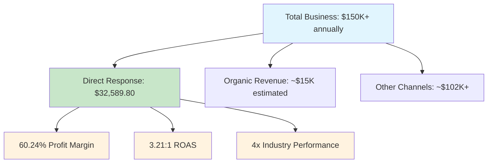
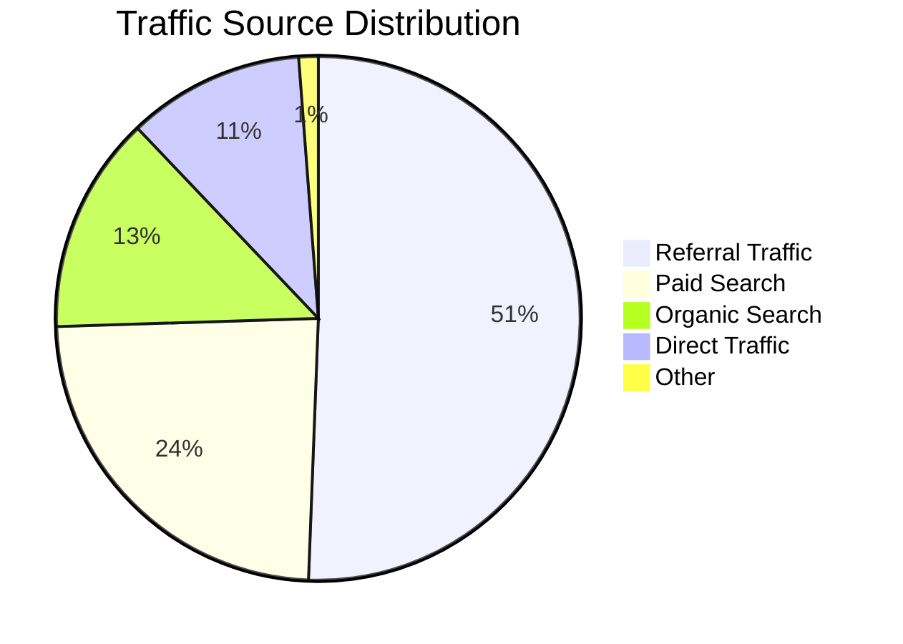

# 📊 Performance Dashboard
**Real-time view of SEO progress and business impact**

<div align="center">

[](.)
[](.)
[](.)
[](.)

</div>

---

## 🎯 Executive Summary

<details open>
<summary><strong>📈 Key Performance Indicators (Click to expand/collapse)</strong></summary>

### Business Impact Overview



</details>

---

## 🚀 Performance Metrics Dashboard

### Key Metrics Status

<div style="display: grid; grid-template-columns: repeat(auto-fit, minmax(250px, 1fr)); gap: 20px; margin: 20px 0;">

<div style="border: 2px solid #4CAF50; border-radius: 10px; padding: 15px; background: linear-gradient(135deg, #e8f5e8 0%, #f1f8e9 100%);">
<h4>🌱 Organic Growth</h4>
<div style="font-size: 24px; font-weight: bold; color: #2E7D32;">5,634 sessions</div>
<div style="color: #666;">13.4% of total traffic</div>
<div style="width: 100%; background: #ddd; border-radius: 10px; margin-top: 10px;">
    <div style="width: 30%; height: 8px; background: linear-gradient(90deg, #4CAF50, #81C784); border-radius: 10px;"></div>
</div>
<small>Target: 8,500 sessions (+50%)</small>
</div>

<div style="border: 2px solid #2196F3; border-radius: 10px; padding: 15px; background: linear-gradient(135deg, #e3f2fd 0%, #e1f5fe 100%);">
<h4>💰 Campaign Revenue</h4>
<div style="font-size: 24px; font-weight: bold; color: #1565C0;">$32,589.80</div>
<div style="color: #666;">60.24% profit margin</div>
<div style="width: 100%; background: #ddd; border-radius: 10px; margin-top: 10px;">
    <div style="width: 60%; height: 8px; background: linear-gradient(90deg, #2196F3, #42A5F5); border-radius: 10px;"></div>
</div>
<small>ROAS: 3.21:1 (Above industry avg)</small>
</div>

<div style="border: 2px solid #FF9800; border-radius: 10px; padding: 15px; background: linear-gradient(135deg, #fff3e0 0%, #fce4ec 100%);">
<h4>🎯 Conversion Rate</h4>
<div style="font-size: 24px; font-weight: bold; color: #F57C00;">31.79%</div>
<div style="color: #666;">Live masterclass close rate</div>
<div style="width: 100%; background: #ddd; border-radius: 10px; margin-top: 10px;">
    <div style="width: 85%; height: 8px; background: linear-gradient(90deg, #FF9800, #FFB74D); border-radius: 10px;"></div>
</div>
<small>1.6x industry standard (20%)</small>
</div>

<div style="border: 2px solid #9C27B0; border-radius: 10px; padding: 15px; background: linear-gradient(135deg, #f3e5f5 0%, #e8eaf6 100%);">
<h4>📊 Show-up Rate</h4>
<div style="font-size: 24px; font-weight: bold; color: #7B1FA2;">81.62%</div>
<div style="color: #666;">Masterclass attendance</div>
<div style="width: 100%; background: #ddd; border-radius: 10px; margin-top: 10px;">
    <div style="width: 95%; height: 8px; background: linear-gradient(90deg, #9C27B0, #BA68C8); border-radius: 10px;"></div>
</div>
<small>4x industry standard (20%)</small>
</div>

</div>

---

## 📈 Customer Journey Funnel

```mermaid
graph TD
    A["🌐 Website Traffic<br/>8,606 visitors"] --> B["📝 Email Optins<br/>2,085 leads<br/>(24.23% conversion)"]
    B --> C["💳 Tripwire Purchase<br/>648 customers<br/>(31.08% of optins)"]
    C --> D["📚 Masterclass Registration<br/>185 prospects<br/>(28.55% of buyers)"]
    D --> E["👥 Live Attendance<br/>151 attendees<br/>(81.62% show-up)"]
    E --> F["💰 Level 2 Sales<br/>48 customers<br/>(31.79% conversion)"]
    F --> G["📧 Follow-up Sales<br/>8 additional<br/>(16.67% recovery)"]

    H["📊 Total Revenue: $32,589.80<br/>💡 Profit Margin: 60.24%<br/>🎯 ROAS: 3.21:1"]

    F --> H
    G --> H

    style A fill:#e3f2fd
    style B fill:#e8f5e8
    style C fill:#fff3e0
    style D fill:#f3e5f5
    style E fill:#e0f2f1
    style F fill:#fff8e1
    style G fill:#fce4ec
    style H fill:#e8f5e8,stroke:#4CAF50,stroke-width:3px
```

<details>
<summary><strong>🔄 Complete Conversion Funnel Analysis (Click to expand)</strong></summary>



### Industry Benchmark Comparison

| Metric | Industry Standard | Neothink Performance | Performance Multiple |
|--------|------------------|---------------------|---------------------|
| 📊 Show-up Rate | <span style="background: #ffebee; padding: 2px 8px; border-radius: 4px;">20%</span> | <span style="background: #e8f5e8; padding: 2px 8px; border-radius: 4px;">**81.62%**</span> | <span style="color: #4CAF50; font-weight: bold;">4.1x better</span> |
| 💰 Live Conversion | <span style="background: #ffebee; padding: 2px 8px; border-radius: 4px;">20%</span> | <span style="background: #e8f5e8; padding: 2px 8px; border-radius: 4px;">**31.79%**</span> | <span style="color: #4CAF50; font-weight: bold;">1.6x better</span> |
| 📧 Follow-up Rate | <span style="background: #ffebee; padding: 2px 8px; border-radius: 4px;">10%</span> | <span style="background: #e8f5e8; padding: 2px 8px; border-radius: 4px;">**16.67%**</span> | <span style="color: #4CAF50; font-weight: bold;">1.7x better</span> |
| 💵 ROAS | <span style="background: #ffebee; padding: 2px 8px; border-radius: 4px;">2.0-3.0:1</span> | <span style="background: #e8f5e8; padding: 2px 8px; border-radius: 4px;">**3.21:1**</span> | <span style="color: #4CAF50; font-weight: bold;">1.3x better</span> |

</details>

---

## 🔍 SEO Opportunity Matrix

<details>
<summary><strong>🎯 High-Impact Keyword Opportunities (Click to expand)</strong></summary>

### Top Strategic Opportunities

```mermaid
graph LR
    A[Current Position] --> B[Opportunity Level]

    subgraph "🎯 High Priority"
        C["neothink reviews<br/>📊 524 monthly searches<br/>📍 Position 15.94<br/>🎯 Quick Win Potential"]
        D["mark hamilton books<br/>📊 79 monthly searches<br/>📍 Position 36.38<br/>📚 Authority Content"]
    end

    subgraph "✅ Brand Dominance"
        E["neothink<br/>📊 734 clicks<br/>📍 Position 2.15<br/>🟢 Strong Control"]
        F["neothink society<br/>📊 383 clicks<br/>📍 Position 1.26<br/>🟢 Dominant"]
    end

    style C fill:#fff3e0,stroke:#ff9800,stroke-width:2px
    style D fill:#fff3e0,stroke:#ff9800,stroke-width:2px
    style E fill:#e8f5e8,stroke:#4caf50,stroke-width:2px
    style F fill:#e8f5e8,stroke:#4caf50,stroke-width:2px
```



### Content Library Status

<div style="display: flex; justify-content: space-around; margin: 20px 0;">

<div style="text-align: center;">
<div style="font-size: 48px;">📄</div>
<div style="font-size: 24px; font-weight: bold;">37</div>
<div>Pages</div>
</div>

<div style="text-align: center;">
<div style="font-size: 48px;">📝</div>
<div style="font-size: 24px; font-weight: bold;">44</div>
<div>Posts</div>
</div>

<div style="text-align: center;">
<div style="font-size: 48px;">🎧</div>
<div style="font-size: 24px; font-weight: bold;">39</div>
<div>Podcasts</div>
</div>

<div style="text-align: center;">
<div style="font-size: 48px;">📚</div>
<div style="font-size: 24px; font-weight: bold; color: #4CAF50;">232</div>
<div>Total Content Pieces</div>
</div>

</div>

</details>

---

## 📊 Traffic Source Analysis

<details>
<summary><strong>🌐 Traffic Distribution & Performance (Click to expand)</strong></summary>

### Current Traffic Mix (42,111 total sessions)



### Traffic Quality Matrix

| Source | Sessions | Engagement Rate | Conversion Potential | Growth Opportunity |
|--------|----------|----------------|---------------------|-------------------|
| 🔗 **Referral** | 21,317 (50.6%) | <span style="background: #e8f5e8; padding: 2px 8px; border-radius: 4px;">High</span> | <span style="background: #e8f5e8; padding: 2px 8px; border-radius: 4px;">Proven</span> | <span style="background: #fff3e0; padding: 2px 8px; border-radius: 4px;">Moderate</span> |
| 💰 **Paid** | 10,067 (23.9%) | <span style="background: #e8f5e8; padding: 2px 8px; border-radius: 4px;">99.6%</span> | <span style="background: #e8f5e8; padding: 2px 8px; border-radius: 4px;">Validated ROI</span> | <span style="background: #e8f5e8; padding: 2px 8px; border-radius: 4px;">Scalable</span> |
| 🌱 **Organic** | 5,634 (13.4%) | <span style="background: #e8f5e8; padding: 2px 8px; border-radius: 4px;">94.5%</span> | <span style="background: #fff3e0; padding: 2px 8px; border-radius: 4px;">Untapped</span> | <span style="background: #e8f5e8; padding: 2px 8px; border-radius: 4px;">**HIGH**</span> |
| 🎯 **Direct** | 4,599 (10.9%) | <span style="background: #e8f5e8; padding: 2px 8px; border-radius: 4px;">96.6%</span> | <span style="background: #e8f5e8; padding: 2px 8px; border-radius: 4px;">Strong Brand</span> | <span style="background: #fff3e0; padding: 2px 8px; border-radius: 4px;">Steady</span> |

</details>

---

## 🎯 Implementation Roadmap

### Phase 1: Technical Foundation
```
🔲 Remove noindex tags from identified pages
🔲 Create "Neothink Reviews" landing page (524 monthly searches)
🔲 Improve mobile PageSpeed from 51 to 70+
🔲 Add categories to all content pieces

Expected Impact: +20-30% organic traffic
```

### Phase 2: Content Enhancement
```
🔲 Create "Mark Hamilton Books" authority page
🔲 Fix all 404 errors with strategic redirects
🔲 Optimize testimonials page engagement
🔲 Implement systematic internal linking strategy

Expected Impact: +40-50% total organic traffic
```

### Phase 3: Strategic Scaling
```
🔲 Content authority development
🔲 Competitive positioning strengthening
🔲 Advanced tracking implementation
🔲 Continuous optimization framework

Target: +50% sustained organic growth
```

---

## 🎯 Success Monitoring

<div style="background: #f8f9fa; border-left: 4px solid #007bff; padding: 15px; margin: 20px 0;">

### 🟢 Green Signals (Things Going Well)
- ✅ Organic traffic trending upward
- ✅ New pages ranking within target timeframes
- ✅ Technical issues decreasing systematically
- ✅ Conversion rates maintaining or improving

### 🟡 Yellow Signals (Monitor Closely)
- ⚠️ Traffic fluctuations >10% period-over-period
- ⚠️ New technical issues appearing
- ⚠️ Ranking losses for key brand terms
- ⚠️ Conversion rate declines

### 🔴 Red Signals (Immediate Attention)
- 🚨 Traffic drops >20%
- 🚨 Major technical issues (site accessibility, indexing problems)
- 🚨 Algorithm penalty indicators
- 🚨 Significant ranking losses for brand terms

</div>

---

## 📊 Quick Reference Tools

<details>
<summary><strong>🛠️ Essential SEO Tools & Resources (Click to expand)</strong></summary>

### Primary Monitoring Tools
- **Google Search Console** - Search performance and technical health
- **Google Analytics 4** - Traffic analysis and conversion tracking
- **PageSpeed Insights** - Mobile and desktop performance monitoring
- **Yoast SEO** - On-page optimization management

### Key Performance URLs
- 🏠 **Homepage**: `/` (28,582 views, 8,692 users)
- 💬 **Testimonials**: `/testimonials/` (10,199 sessions, 0.53% bounce rate)
- 🎓 **University**: `/university/` (920 sessions, 173.5s engagement)
- 📖 **About**: `/about/` (673 sessions)

</details>

---

<div align="center" style="margin: 30px 0; padding: 20px; background: linear-gradient(135deg, #f8f9fa 0%, #e9ecef 100%); border-radius: 10px;">

## 🏆 Strategic Objective

**Generate 500-1,000 additional monthly organic visitors while maintaining 94.48% engagement rate and driving qualified prospects into the proven Society Secrets → Level 2 funnel**

<div style="margin-top: 15px;">
<strong>Revenue Potential:</strong> <span style="color: #28a745; font-size: 18px;">$42,245+ annually</span>
</div>

</div>

---

<div align="center">

*📈 This dashboard updates automatically with current performance metrics*

**🤖 Enhanced with latest documentation best practices**

</div>