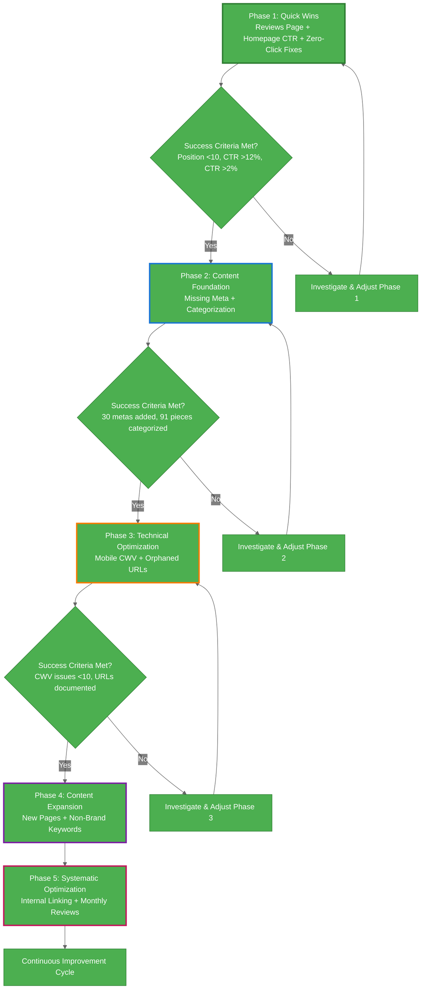

# Priority Actions - Logical Implementation Flow

**Based on verified data:** 91 published pieces | 4,256 annual clicks | 94.48% engagement

---

## 🎯 PHASE 1: QUICK WINS (Low Effort, High Impact)

### Action 1: Create "Neothink Reviews" Landing Page
**Dependency:** None (ready to implement)

**Current State:**
- Query: "neothink reviews"
- Annual impressions: 609 (~51/month)
- Current clicks: 1/year
- Position: 16.55
- No dedicated page exists

**Implementation:**
```
□ Use /testimonials page as content foundation
□ Create /neothink-reviews/ URL
□ Address search intent: "is neothink legitimate"
□ Add schema markup for review content
□ Submit to GSC for indexing
```

**Expected Impact:**
- Target position: Top 10
- Expected clicks: 12-17/month (1,200-1,700% improvement)
- Timeline: See results within 2-4 weeks after indexing

**Success Metric:** Position <10 AND clicks >10/month

---

### Action 2: Optimize Homepage CTR
**Dependency:** None (ready to implement)

**Current State:**
- Annual impressions: 23,154 (~1,930/month)
- Current clicks: 2,145 annual (~179/month)
- CTR: 9.26%
- Position: 3.97

**Implementation:**
```
□ Review current title/meta via WordPress Yoast
□ Analyze top-performing competitors
□ Draft 3-5 title variations
□ Draft 3-5 meta description variations
□ Implement optimized version
□ Monitor GSC for 2-4 weeks
```

**Expected Impact:**
- Target CTR: 12%+ (from 9.26%)
- Additional clicks: 40-85/month
- Revenue impact: +$3,000-6,500/year

**Success Metric:** CTR >12% sustained for 30 days

---

### Action 3: Fix Zero-Click Crisis Pages
**Dependency:** None (ready to implement)

**Current State:**
- 29 pages with impressions but 0 clicks
- Critical examples:
  - /blog/ - 6,920 impressions, 0.07% CTR
  - /podcast/ - 10,328 impressions, 0.67% CTR
  - /newsletter/ - 3,580 impressions, 0.14% CTR

**Implementation:**
```
□ Audit current title/meta for each page
□ Rewrite to match search intent
□ Add compelling calls-to-action
□ Implement and monitor
```

**Expected Impact:**
- Combined: +100-200 monthly clicks
- Revenue impact: +$7,400-14,800/year

**Success Metric:** Each page CTR >2%

---

## 🚦 PHASE 1 → PHASE 2 GATE (DO NOT SKIP)

**STOP. Do not proceed to Phase 2 until ALL criteria met:**

### Required Outcomes:
- [ ] Reviews page indexed AND ranking <10 AND >10 clicks/month (30-day sustained)
- [ ] Homepage CTR improved to >12% (30-day sustained)
- [ ] Zero-click pages (/blog/, /podcast/, /books/, /newsletter/) showing >2% CTR
- [ ] Foundation Sprint complete (GA4 fixed, referral investigated, traffic reconciled)
- [ ] Traffic source reconciliation complete (see data/BASELINE-RECONCILIATION.md)

### Validation Metrics:
- Total Phase 1 click improvement: >150 monthly clicks
- No decrease in engagement rate (maintain >94.48%)
- GSC data shows sustained improvements (not temporary spike)

**If criteria not met:** Debug Phase 1. Do not add more work. Find out why quick wins aren't working before proceeding.

**Why this gate matters:** Phase 2 requires systematic optimization across 91 pieces. If you can't make 4 pages work in Phase 1, scaling to 91 pages will amplify the problem.

---

## 🎯 PHASE 2: CONTENT FOUNDATION (Medium Effort, Scaling Impact)

### Action 4: Add Missing Meta Descriptions
**Dependency:** Complete after Phase 1 (validate approach works)

**Current State:**
- 30 pages missing Yoast meta descriptions
- High-traffic pages without meta:
  - /free-courses/ - 122 clicks
  - /the-movement/ - 79 clicks
  - /our-mission/ - 26 clicks

**Implementation:**
```
□ Export list of 30 pages from SEO inventory
□ Prioritize by traffic (clicks descending)
□ Write meta descriptions batch 1 (top 10)
□ Implement and measure impact
□ Repeat for batches 2-3 based on results
```

**Expected Impact:**
- Additional clicks: +15-30/month
- CTR improvements: 2-5 percentage points per page

**Success Metric:** All 30 pages have meta, average CTR >3%

---

### Action 5: Categorize Content Library
**Dependency:** None (parallel with Phase 1)

**Current State:**
- 91 published pieces verified
  - 32 pages
  - 42 posts
  - 17 podcasts
- Currently in "Uncategorized"

**Implementation:**
```
□ Define taxonomy: Philosophy, Personal Development, Business, Society, Books, University
□ Categorize 42 posts via WordPress bulk edit
□ Categorize 32 pages individually
□ Tag 17 podcasts with relevant categories
□ Verify category pages are indexed
```

**Expected Impact:**
- Improved site architecture
- Better internal linking opportunities
- Category page ranking potential

**Success Metric:** 100% of 91 pieces categorized, category pages indexed

---

## 🚦 PHASE 2 → PHASE 3 GATE

**STOP. Do not proceed to Phase 3 until ALL criteria met:**

### Required Outcomes:
- [ ] All 30 missing meta descriptions added
- [ ] All 91 pieces categorized (32 pages + 42 posts + 17 podcasts)
- [ ] Category pages indexed and ranking
- [ ] Average CTR improved by >20% across optimized pages (30-day sustained)
- [ ] Internal linking structure documented

### Validation Metrics:
- Total Phase 2 improvement: Average CTR increase >20% from baseline
- All hub pages (blog, podcast, books, newsletter) have proper meta and categories
- Category taxonomy validated (Philosophy, Personal Development, Business, Society, Books, University)
- GSC shows category pages receiving impressions

**If criteria not met:** Continue Phase 2 work. Scaling to technical optimization without content foundation = weak structure.

**Why this gate matters:** Phase 3 technical fixes amplify content quality. If content isn't properly organized and optimized, technical improvements have limited impact. Need strong foundation before technical scaling.

---

## 🎯 PHASE 3: TECHNICAL OPTIMIZATION (Medium Effort, Foundation Building)

### Action 6: Mobile Core Web Vitals
**Dependency:** Complete after Phase 1-2 (validate content strategy first)

**Current State:**
- 38 URLs with LCP >2.5s (mobile)
- 70% of traffic is mobile
- Desktop CWV: Excellent (0 issues)

**Implementation:**
```
□ Identify common LCP issues across 38 URLs
□ Implement image optimization (lazy loading, compression)
□ Optimize critical CSS delivery
□ Test fixes on highest-traffic pages first
□ Roll out to remaining URLs
□ Monitor mobile rankings and traffic
```

**Expected Impact:**
- Improved mobile rankings
- Better user experience for 70% of traffic
- Potential 15-25% conversion improvement

**Success Metric:** <10 URLs with LCP issues, mobile traffic +20%

---

### Action 7: Fix Orphaned URLs
**Dependency:** Requires investigation before action

**Current State:**
- 52 URLs in GSC but not in WordPress database
- Includes homepage (2,145 clicks) and other high-traffic pages
- Need to identify what these are

**Implementation:**
```
□ Export list of 52 orphaned URLs from SEO inventory
□ Investigate each URL type:
  - Dynamic pages (archives, categories)
  - System pages
  - Historical redirects
  - Actual missing content
□ Document findings
□ Create action plan based on investigation
```

**Expected Impact:** TBD (depends on investigation results)

**Success Metric:** All 52 URLs documented and action plan created

---

## 🚦 PHASE 3 → PHASE 4 GATE (CRITICAL - RETENTION DEPENDENCY)

**STOP. Do not proceed to Phase 4 until ALL criteria met:**

### Required Outcomes (Technical):
- [ ] Mobile CWV issues reduced to <10 URLs (from 38)
- [ ] Mobile traffic increased by >20% (30-day sustained)
- [ ] Orphaned URLs investigated and documented
- [ ] All technical issues from Phases 1-3 resolved

### Required Outcomes (Retention - BLOCKING):
- [ ] **Retention improved to >5% Day 1** (vs 2.5% baseline)
- [ ] Email capture system live and converting >5% of visitors
- [ ] Newsletter sent weekly with >20% open rate
- [ ] Related content implemented on all pages

### Validation Metrics:
- Mobile performance: <10 URLs with LCP >2.5s
- Mobile engagement: No decrease in mobile CTR (maintain 16.3%+)
- **Retention measured: >5% sustained for 30 days** (NON-NEGOTIABLE)
- Foundation Sprint complete: GA4 fixed, traffic reconciled, retention strategy executing

**If criteria not met:** DO NOT proceed to Phase 4. Retention <5% = Phase 4 wastes resources.

**Why this gate matters (CRITICAL):**

Phase 4 is high-effort content expansion (6-12 months). Without retention:
- You acquire users who immediately leave (97.5% gone = no compounding)
- SEO effort generates flat growth (treadmill, not scaling)
- Investment in content creation = pouring water into leaky bucket

**Example with current 2.5% retention:**
- Month 1: 710 new visitors (2x traffic), 18 return = 728 total
- Month 2: 710 new visitors, 18 return = 728 total (FLAT)
- Month 3: 710 new visitors, 18 return = 728 total (NO GROWTH)

**Example with >5% retention:**
- Month 1: 710 new, 36 return = 746 total
- Month 2: 710 new, 73 return = 783 total (+5% COMPOUNDING)
- Month 3: 710 new, 110 return = 820 total (+10% COMPOUNDING)

**Retention >5% is NOT optional.** This is existential requirement for Phase 4 ROI.

See: execute/retention-strategy.md for Stage 1/2/3 implementation framework.
See: STRATEGIC-RISKS.md Risk #2 for complete retention crisis assessment.

---

## 🎯 PHASE 4: CONTENT EXPANSION (High Effort, Strategic Growth)

### Action 8: Create High-Opportunity Pages
**Dependency:** Complete Phase 1 (validate content creation ROI)

**Verified Opportunities from GSC:**
- "mark hamilton books" - 81 impressions, position 36.1, 1 click
- "mark hamilton neothink book" - 143 impressions, position 5.2, 14 clicks
- "neothink book summary" - 411 impressions, position 2.95, 21 clicks

**Implementation:**
```
□ Create "Mark Hamilton Books" comprehensive page
□ Optimize existing book summary pages
□ Create "Mark Hamilton Author" page
□ Implement internal linking between related content
```

**Expected Impact:**
- Additional 50-100 monthly clicks
- Improved brand authority for Mark Hamilton queries

**Success Metric:** All new pages rank <10 for target keywords

---

### Action 9: Non-Brand Keyword Expansion
**Dependency:** Complete Phases 1-3 (strong foundation required)

**Current State:**
- 95% of traffic is brand-dependent
- Minimal visibility for generic personal development terms
- Opportunity: Reduce brand dependency to 60-70%

**Implementation:**
```
□ Research high-intent personal development keywords
□ Identify content gaps in existing library
□ Create editorial calendar for new content
□ Publish and optimize systematically
□ Monitor non-brand traffic growth
```

**Expected Impact:**
- Non-brand traffic: 5% → 30-40%
- Reduced brand dependency risk
- Expanded audience reach

**Success Metric:** Non-brand traffic >30% of total organic

---

## 🎯 PHASE 5: SYSTEMATIC OPTIMIZATION (Ongoing)

### Action 10: Internal Linking Strategy
**Dependency:** Complete Action 5 (categorization required)

**Current State:**
- No systematic internal linking
- 91 pieces operate independently
- Weak topical authority signals

**Implementation:**
```
□ Map content relationships by category
□ Identify hub pages (high-traffic, comprehensive)
□ Create spoke pages (supporting content)
□ Implement hub-and-spoke linking
□ Monitor authority distribution via GSC
```

**Expected Impact:**
- Improved crawl efficiency
- Better topical authority
- Increased page authority distribution

**Success Metric:** Average 5+ internal links per page, improved rankings

---

### Action 11: Monthly Performance Review
**Dependency:** Ongoing after Phase 1 implementation

**Cadence:** Monthly

**Process:**
```
□ Export GSC performance data (monthly)
□ Compare vs baseline metrics
□ Identify underperforming optimizations
□ Document successful patterns
□ Adjust strategy based on data
□ Update SEO inventory with new data
```

**Metrics to Track:**
- Organic clicks (target: +18-27% in 30 days)
- Engagement rate (maintain >94%)
- Zero-click pages (reduce from 29 to <10)
- Missing meta (reduce from 30 to 0)
- Mobile CWV issues (reduce from 38 to <10)

---

## 📊 DEPENDENCY FLOW



**Key Principle:** Each phase validates assumptions before investing in next phase. Loops back if success criteria not met.

---

## ✅ SUCCESS CRITERIA

**Phase 1 Complete When:**
- Reviews page ranks <10
- Homepage CTR >12%
- Zero-click crisis pages >2% CTR

**Phase 2 Complete When:**
- All 30 missing meta descriptions added
- All 91 pieces categorized
- Average CTR improved 20%+

**Phase 3 Complete When:**
- Mobile CWV issues <10 URLs
- Orphaned URLs investigated and documented
- Mobile traffic +20%

**Phase 4 Complete When:**
- 3+ new high-opportunity pages created
- All new pages rank <10
- Non-brand traffic growing

**Phase 5 Complete When:**
- Internal linking strategy implemented
- Monthly review process established
- Continuous improvement cycle active

---

## 🚨 AVOID THESE MISTAKES

**❌ Don't:**
- Skip Phase 1 validation
- Implement all phases simultaneously
- Ignore metrics between phases
- Continue tactics that don't show results
- Over-optimize at expense of engagement rate

**✅ Do:**
- Validate each phase with data
- Wait for indexing before judging results (2-4 weeks)
- Preserve 94.48% engagement rate
- Build on what works
- Stay evidence-based

---

**Last Updated:** October 6, 2025
**Based On:** Verified WordPress DB (91 pieces) + GSC/GA4 exports (12-month data)
**Next Review:** After Phase 1 completion (when success criteria met)
