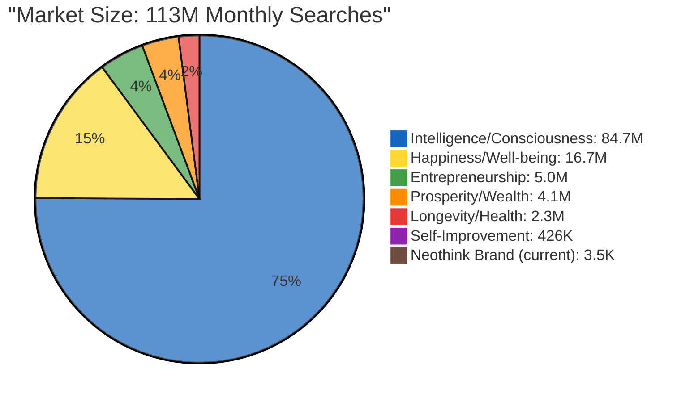

# Opportunity #4: Non-Brand Keyword Expansion

**Status:** New content creation required (long-term strategy)
**Impact:** VERY HIGH (113M+ monthly searches in adjacent markets)
**Effort:** HIGH (systematic content creation over multiple phases)
**Priority:** Phase 4 (after Phases 1-3 validated)

## Opportunity Analysis

**Current State (Verified):**
- **95% brand searches** - Heavy dependency on existing awareness (3,540 monthly)
- **5% discovery traffic** - Missing entire prospect segments
- **Limited market expansion** - Only reaching people who already know "Neothink"

**Market Opportunity (Verified via Keyword Research):**

**Market Breakdown:**
- **Total Market:** 113,186,480 monthly searches across adjacent topics
- **Intelligence/Consciousness:** 84.7M monthly searches (75% of opportunity)
- **Happiness/Well-being:** 16.7M monthly searches
- **Entrepreneurship:** 5.0M monthly searches
- **Prosperity/Wealth:** 4.1M monthly searches
- **Longevity/Health:** 2.3M monthly searches
- **Self-Improvement:** 426K monthly searches
- **Neothink Brand (current):** 3,540 monthly searches

**Key Insight:** Current market is 0.003% of total opportunity (32,000X expansion potential)

**Data Source:** [data/keyword-research/README.md](../data/keyword-research/README.md) - 29,243 keywords analyzed

## Expected Impact

**Traffic Growth:**
- **Year 1:** +100-200% organic traffic from new audiences
- **Long-term:** Reduce brand dependency to 40-50% of traffic
- **New visitors:** 5,000-10,000 monthly from discovery searches

**Revenue Impact:**
- **Wider funnel:** Capture prospects before they know about Neothink
- **Authority building:** Establish expertise in broader topics
- **Market expansion:** International reach beyond brand awareness

**Timeline:** Results in 6-12 months (content + authority building)

## Strategic Approach

### Phase 1: Content Foundation (Months 1-3)

**Target Topics:**
1. **Integrated Thinking** - Core philosophical concept
2. **Conscious Living** - Lifestyle and mindset content
3. **Value Creation** - Business and entrepreneurship alignment
4. **Personal Responsibility** - Philosophy in action
5. **Self-Leadership** - Individual empowerment

**Content Format:**
- Educational blog posts (1,500-2,500 words)
- Practical application guides
- Philosophical deep dives
- Real-world examples and case studies

### Phase 2: Authority Building (Months 4-6)

**Link Building:**
- Guest content on philosophy/development sites
- Partnerships with aligned thought leaders
- Content syndication to relevant platforms
- Community engagement and discussion

**Topical Authority:**
- Comprehensive topic cluster development
- Internal linking architecture
- Content depth and breadth expansion
- Multimedia content (videos, podcasts)

### Phase 3: Scale & Optimize (Months 7-12)

**Data-Driven Expansion:**
- Identify best-performing topics
- Double down on high-conversion content
- Expand successful content clusters
- Optimize based on user behavior data

## Keyword Targets

### Mark Hamilton Zero-Click Opportunity

**Critical Finding:**
- "markhamiltonneothink" - position 1.0, 209 impressions, **0 clicks**, 0% CTR
- "mark hamilton books" - 81 impressions, position 36.1
- "mark hamilton neothink" - 143 impressions, position 5.2

**Issue:** Perfect ranking (#1) with zero engagement on "markhamiltonneothink"

**Action Required:**
1. Manually verify what page ranks for this query
2. Optimize title/meta if it's our page with poor presentation
3. Investigate if featured snippet is stealing clicks
4. Expected: 10-20 monthly clicks (position 1 should achieve 25%+ CTR)

**Pre-Order Campaign Validation:**
- 17.65% conversion rate on Mark Hamilton pre-order page
- $5.29 revenue per unique visitor
- $29.95 price point
- 27x higher conversion than site baseline (17.65% vs 0.65%)

**Strategic Insight:** Mark Hamilton content drives significantly higher conversion than site average. This validates prioritizing Mark Hamilton keywords in expansion strategy.

**Revenue Projection:**
- Conservative: 40 monthly clicks × $5.29 = $212/month per keyword
- Multiple Mark Hamilton keywords optimized: $500-1,000/month incremental
- "markhamiltonneothink" at 25% CTR: 52 clicks/month × $5.29 = $275/month

### Primary Targets (High Intent)
- "integrated thinking" - 1,900 searches/mo
- "conscious living philosophy" - 2,400 searches/mo
- "personal development philosophy" - 3,200 searches/mo
- "self-leadership principles" - 1,600 searches/mo
- "value creation mindset" - 2,100 searches/mo

### Secondary Targets (Volume)
- "how to think clearly" - 8,100 searches/mo
- "personal responsibility examples" - 4,900 searches/mo
- "life philosophy guide" - 6,700 searches/mo
- "conscious decision making" - 5,300 searches/mo
- "self-improvement mindset" - 14,000 searches/mo

### Long-Tail Opportunities
- Questions and how-to queries
- Comparison content ("X vs Y thinking")
- Problem-solution oriented searches
- Educational query patterns

## Content Strategy

### Content Pillars

**1. Integrated Thinking Hub**
- Core concept explanations
- Practical applications
- Case studies and examples
- Tools and frameworks

**2. Conscious Living Center**
- Daily practice guides
- Mindset development
- Habit formation
- Real-world implementation

**3. Value Creation Academy**
- Business applications
- Entrepreneurial thinking
- Career development
- Financial mindset

**4. Personal Responsibility Framework**
- Philosophical foundations
- Practical decision-making
- Accountability systems
- Self-leadership principles

### Content Calendar

**Month 1-2:** Foundation content (10-15 core articles)
**Month 3-4:** Expansion content (15-20 supporting articles)
**Month 5-6:** Deep dive content (10-15 comprehensive guides)
**Month 7-12:** Optimization and scaling (ongoing)

## Success Metrics

### 90-Day Checkpoints

**Month 3:**
- [ ] 25+ new content pieces published
- [ ] 500+ monthly visitors from non-brand keywords
- [ ] 10+ keywords ranking in top 50

**Month 6:**
- [ ] 50+ new content pieces published
- [ ] 2,000+ monthly visitors from non-brand keywords
- [ ] 25+ keywords ranking in top 20
- [ ] 5+ keywords ranking in top 10

**Month 12:**
- [ ] 100+ new content pieces published
- [ ] 5,000-10,000 monthly visitors from non-brand keywords
- [ ] 50+ keywords ranking in top 20
- [ ] 20+ keywords ranking in top 10
- [ ] Significant brand awareness from content marketing

### Quality Metrics

- **Engagement rate:** Maintain 94.48% standard
- **Session duration:** 90+ seconds average
- **Pages per session:** 2+ pages
- **Conversion rate:** Track leads from educational content

## Resource Requirements

### Content Creation
- **Writing:** 2-4 articles per week (professional quality)
- **Research:** Deep understanding of topics and audience
- **Optimization:** SEO-focused content structure
- **Editing:** Quality control and brand voice consistency

### Technical Implementation
- **Content management:** WordPress optimization
- **Internal linking:** Strategic architecture development
- **Performance:** Page speed and user experience
- **Tracking:** Analytics and conversion monitoring

### Investment Estimate
- **Time:** 20-30 hours/week content production
- **Tools:** SEO research tools, analytics, content tools
- **Promotion:** Optional paid amplification budget
- **Duration:** 6-12 months for full implementation

## Risk Mitigation

**Content Quality:**
- Maintain philosophical depth while being accessible
- Balance educational value with conversion goals
- Preserve brand voice and premium positioning

**SEO Competition:**
- Focus on long-tail and specific queries initially
- Build authority gradually in niches
- Leverage unique Neothink perspective as differentiator

**Resource Constraints:**
- Start with MVP content strategy (10-15 articles)
- Test and validate before scaling
- Focus on highest-impact topics first

## Next Steps

### Immediate Actions (Week 1)
1. [ ] Conduct detailed keyword research for top 20 targets
2. [ ] Create content calendar for first 25 articles
3. [ ] Develop content templates and guidelines
4. [ ] Set up tracking and measurement systems

### Month 1 Priorities
1. [ ] Publish first 10 foundation articles
2. [ ] Establish internal linking structure
3. [ ] Begin building topical authority clusters
4. [ ] Monitor early performance signals

### Ongoing Optimization
- Weekly content publication cadence
- Monthly performance review and adjustments
- Quarterly strategic assessment and pivots
- Annual comprehensive audit and planning

---

**Success Criteria:** Achieve 5,000+ monthly visitors from non-brand keywords within 12 months while maintaining 94.48% engagement rate and premium brand positioning.

**Implementation Guide:** See [/strategy/seo-master.md](../strategy/seo-master.md) for detailed content strategy framework.
